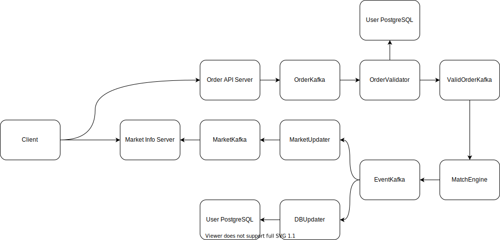

# exchange
### A high throughput, low latency crypto exchange

## Architecture

## exchange binary

All in one, using threads. later we consider use tokio for more efficient asynchronous, last we consider use kafka to separate different functionalities for higher throughput.

## web

connecting to backend by websocket only, using msgpack as enconding format. there's no other api like rest.